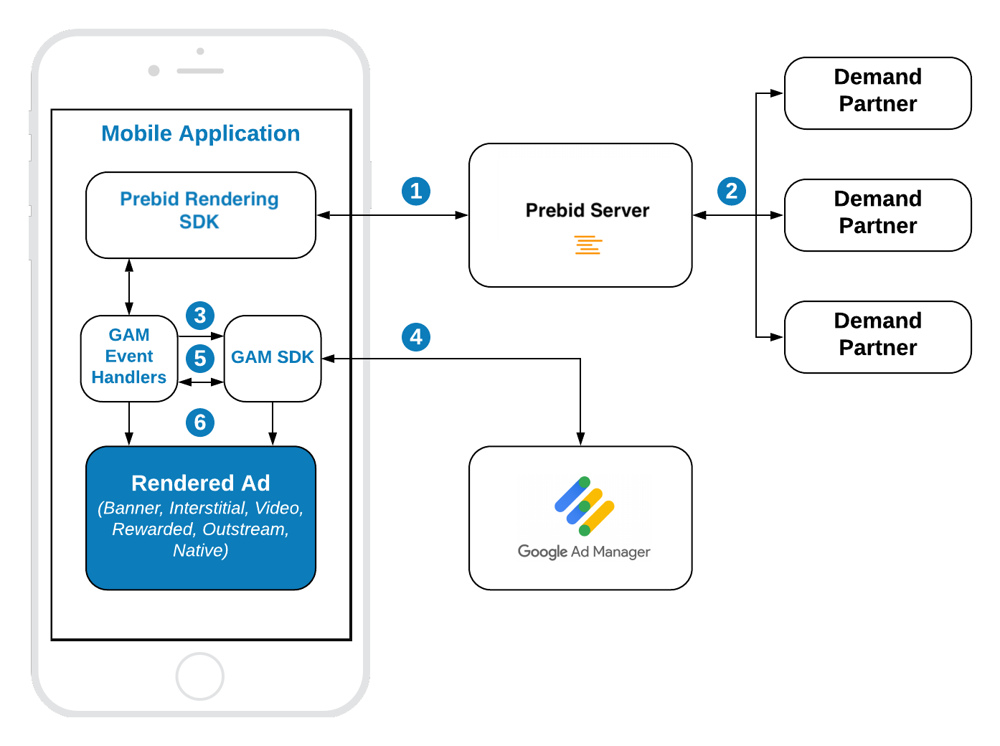

# Google Ad Manager Integration

The integration of Prebid Rendering Module with Google Ad Manager (GAM) assumes that publisher has an account on GAM and has already integrated the Google Mobile Ads SDK (GMA SDK) into the app project. 

If you do not have GAM SDK in the app yet, refer the the [Google Integration Documentation](https://developers.google.com/ad-manager/mobile-ads-sdk/android/quick-start).

## GAM Integration Overview



**Steps 1-2** Prebid Rendering Module makes a bid request. Prebid server runs an auction and returns the winning bid.

**Step 3** Prebid Rendering Module via GAM Event Handler sets up the targeting keywords into the GAM's ad unit.

**Step 4** GMA SDK makes an ad request. GAM returns the winner of the waterfall.

**Step 5** Basing on the ad response Prebid GAM Event Handler decided who won on the GAM - the Prebid bid or another ad source on GAM.

**Step 6** The winner is displayed in the App with the respective rendering engine.
  
Prebid Rendering Module supports these ad formats:

- Display Banner
- Display Interstitial
- Native
- [Native Styles](android-in-app-bidding-gam-native-integration.md)
- Video Interstitial 
- Rewarded Video
- Outstream Video

They can be integrated using these API categories.

- [**Banner API**](#banner-api) - for *Display Banner* and *Outstream Video*
- [**Interstitial API**](#interstitial-api) - for *Display* and *Video* Interstitials
- [**Rewarded API**](#rewarded-api) - for *Rewarded Video*
- [**Native API**](android-in-app-bidding-gam-native-integration.md) - for *Native Ads*

## Banner API

Integration example:

``` kotlin
// 1. Create banner custom event handler for GAM ad server.
val eventHandler = GamBannerEventHandler(requireContext(), GAM_AD_UNIT, GAM_AD_SIZE)

// 2. Create a bannerView instance and provide GAM event handler
bannerView = BannerView(requireContext(), configId, eventHandler)
// (Optional) set an event listener
bannerView?.setBannerListener(this)

// Add bannerView to your viewContainer
viewContainer?.addView(bannerView)

// 3. Execute ad loading
bannerView?.loadAd()
```

#### Step 1: Create Event Handler
To create the event handler you should provide
- a **GAM Ad Unit Id**
- list of available **sizes** for this ad unit.

#### Step 2: Create Ad View

**BannerView** - is a view that will display the particular ad. It should be added to the UI. To create it you should provide:

- **configId** - an ID of Stored Impression on the Prebid server
- **eventHandler** - the instance of the banner event handler

Also, you should add the instance of `BannerView` to the UI.

And assign the listeners for processing ad events.

#### Step 3: Load the Ad

Simply call the `loadAd()` method which will make a request to Prebid server.

### Outstream Video

For **Outstream Video** you also need to specify video placement type of the expected ad:

``` kotlin
bannerView.videoPlacementType = PlacementType.IN_BANNER // or any other available type
```

## Interstitial API

Integration example:

``` kotlin
// 1. Create interstitial custom event handler for GAM ad server.
val eventHandler = GamInterstitialEventHandler(requireContext(), gamAdUnit)

// 2. Create interstitialAdUnit instance and provide GAM event handler
interstitialAdUnit = InterstitialAdUnit(requireContext(), configId, minSizePercentage, eventHandler)
// (Optional) set an event listener
interstitialAdUnit?.setInterstitialAdUnitListener(this)

// 3. Execute ad load
interstitialAdUnit?.loadAd()

//....

// 4. After ad is loaded you can execute `show` to trigger ad display
interstitialAdUnit?.show()

```

The way of displaying **Video Interstitial Ad** is almost the same with two differences:

- Need to customize the ad unit format
- No need to set up `minSizePercentage`

``` kotlin
// 1. Create interstitial custom event handler for GAM ad server.
val eventHandler = GamInterstitialEventHandler(requireContext(), gamAdUnit)

// 2. Create interstitialAdUnit instance and provide GAM event handler
interstitialAdUnit = InterstitialAdUnit(requireContext(), configId, AdUnitFormat.VIDEO, eventHandler)

// (Optional) set an event listener
interstitialAdUnit?.setInterstitialAdUnitListener(this)

// 3. Execute ad load
interstitialAdUnit?.loadAd()

//....

// 4. After ad is loaded you can execute `show` to trigger ad display
interstitialAdUnit?.show()

```


#### Step 1: Create Event Handler

To create the event handler you should provide a **GAM Ad Unit Id**

#### Step 2: Create Interstitial Ad Unit

**InterstitialAdUnit** - is an object that will load and display the particular ad. To create it you should provide:

- **configId** - an ID of Stored Impression on the Prebid server
- **minSizePercentage** - specifies the minimum width and height percent an ad may occupy of a device’s real estate.
- **eventHandler** - the instance of the interstitial event handler

Also, you can assign the listeners for processing ad events.

> **NOTE:** minSizePercentage - plays an important role in a bidding process for display ads. If provided space is not enough demand partners won't respond with the bids.


#### Step 3: Load the Ad

Simply call the `loadAd()` method which will make a request to Prebid server.


#### Step 4: Show the Ad when it is ready


Wait until the ad will be loaded and present it to the user in any suitable time.

``` kotlin
override fun onAdLoaded(interstitialAdUnit: InterstitialAdUnit) {
//Ad is ready for display
}
```

## Rewarded API

Integration example:

``` kotlin
// 1. Create rewarded custom event handler for GAM ad server.
val eventHandler = GamRewardedEventHandler(requireActivity(), gamAdUnitId)

// 2. Create rewardedAdUnit instance and provide GAM event handler
rewardedAdUnit = RewardedAdUnit(requireContext(), configId, eventHandler)

// (Optional) set an event listener
rewardedAdUnit?.setRewardedAdUnitListener(this)

// 3. Execute ad load
rewardedAdUnit?.loadAd()

//...

// 4. After ad is loaded you can execute `show` to trigger ad display
rewardedAdUnit?.show()
```

The way of displaying the **Rewarded Ad** is totally the same as for the Interstitial Ad. You can customize a kind of ad:


To be notified when user earns a reward - implement `RewardedAdUnitListener` interface:

``` kotlin
 fun onUserEarnedReward(rewardedAdUnit: RewardedAdUnit)
```

The actual reward object is stored in the `RewardedAdUnit`:

``` kotlin
val reward = rewardedAdUnit.getUserReward()
```

#### Step 1: Create Event Handler

To create an event handler you should provide a **GAM Ad Unit Id**.


#### Step 2: Create Rewarded Ad Unit

**RewardedAdUnit** - is an object that will load and display the particular ad. To create it you should provide

- **configId** - an ID of Stored Impression on the Prebid server
- **eventHandler** - the instance of rewarded event handler

Also, you can assign the listener for processing ad events.


#### Step 3: Load the Ad

Simply call the `loadAd()` method which will make a request to Prebid server.


#### Step 4: Show the Ad when it is ready


Wait until the ad will be loaded and present it to the user in any suitable time.

``` kotlin
override fun onAdLoaded(rewardedAdUnit: RewardedAdUnit) {
//Ad is ready for display
}
```