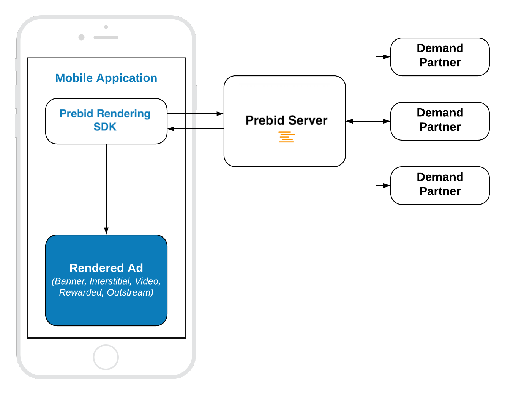

# Pure In-App Bidding Integration

## Table of Contents

- [Mobile API](#mobile-api)
- [Banner](#banner-api)
- [Interstitial](#interstitial-api)
- [Rewarded](#rewarded-api)

## Mobile API

The Pure In-App Bidding integration is similar to the integration of any other regular Ad SDK.




Prebid Rendering Module provides ability to integrate  these ad formats:

- Display Banner
- Display Interstitial
- Video Interstitial
- Rewarded Video
- Outstream Video
- [Native](ios-in-app-bidding-prebid-native-integration.md)

However, the  Rendering Module provides only three kinds of API classes for these ads:

- **Banner API** - for **Display Banner** 
- **Interstitial API** - for **Display** and **Video** Interstitials
- **Rewarded API** - for **Rewarded Video**

### Banner API

Integration example:

``` swift
// 1. Create an Ad View
let banner = BannerView(frame: CGRect(origin: .zero, size: adSize),
                           configId: CONFIG_ID,
                           adSize: adSize)
    
banner.delegate = self
    
// 2. Load an Ad
banner.loadAd()
```

#### Step 1: Create Ad View

Initialize the Banner Ad View with properties:

- **frame** - the frame rectangle for the view
- **configId** - an ID of Stored Impression on the Prebid server
- **size** - the size of the ad unit which will be used in the bid request.

#### Step 2: Load the Ad

Call the method `loadAd()` which will:

- make a bid request to Prebid server.
- render the winning bid on display.

#### Outstream Video

For **Outstream Video** you also need to specify the kind of expected ad:

``` swift
banner.adFormat = .video
```

### Interstitial API

Integration example:

``` swift
// 1. Create an Interstitial Ad Unit
interstitial = InterstitialAdUnit(configId: CONFIG_ID,
                                     minSizePercentage: CGSize(width: 30, height: 30))
    
interstitial.delegate = self
    
// 2. Load an Ad
interstitial.loadAd()

// .....

// 3. Show An Ad
if interstitial.isReady {
    interstitial.show(from: self)
}

```

The way of displaying **Video Interstitial Ad** is almost the same with two differences:

- Need to customize the ad unit kind
- No need to set up `minSizePercentage`

``` swift

// 1. Create an Interstitial Ad Unit
let interstitial = InterstitialAdUnit(configId: CONFIG_ID)
    
interstitial.adFormat = .video
interstitial.delegate = self
    
// 2. Load an Ad
interstitial.loadAd()

// .....

// 3. Show An Ad
if interstitial.isReady {
    interstitial.show(from: self)
}

```

#### Step 1: Create an Ad Unit


Initialize the Interstitial Ad Unit with properties:


- **configId** - an ID of Stored Impression on the Prebid server
- **minSizePercentage** - specifies the minimum width and height percent an ad may occupy of a device’s real estate.

> **NOTE:** minSizePercentage - plays an important role in a bidding process for display ads. If provided space is not enough demand partners won't respond with the bids.

#### Step 2: Load the Ad

Call the method `loadAd()` which will make a bid request to Prebid server.


#### Step 3: Show the Ad when it is ready

Wait until the ad will be loaded and present it to the user in any suitable time.

``` swift
// MARK: InterstitialAdUnitDelegate
    
func interstitialDidReceiveAd(_ interstitial: InterstitialAdUnit) {
    // Now the ad is ready for display
}
```


### Rewarded API

Integration example:

``` swift
// 1. Create an Ad Unit
rewardedAd = RewardedAdUnit(configId: CONFIG_ID)
rewardedAd.delegate = self
    
// 2. Load an Ad
rewardedAd.loadAd()

/// .......

// 3. Display the Ad
if rewardedAd.isReady {
    rewardedAd.show(from: self)
}
```


#### Step 1: Create Rewarded Ad Unit

Create the **RewardedAdUnit** object with parameter:

- **adUnitId** - an ID of Stored Impression on the Prebid server

#### Step 2: Load the Ad

Call the `loadAd()` method which will make a bid request to Prebid server.

#### Step 3: Show the Ad when it is ready

Wait until the ad will be loaded and present it to the user in any suitable time.

``` swift
// MARK: PBMRewardedAdUnitDelegate
    
func rewardedAdDidReceiveAd(_ rewardedAd: RewardedAdUnit) {
    // Now the ad is ready for display
}   
```


