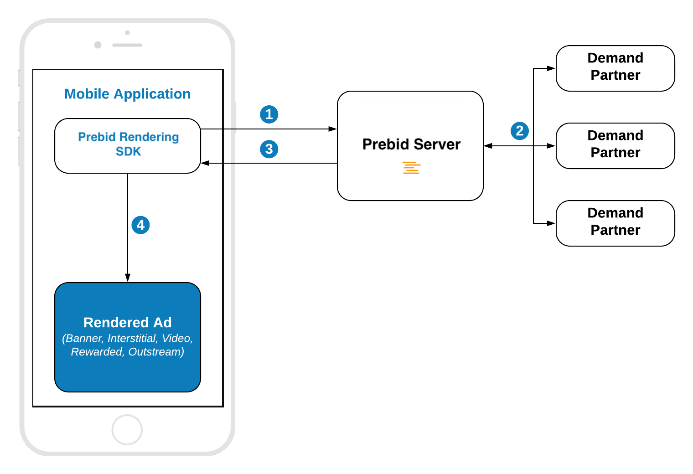

# In-App Bidding with Rendering Module

## Integration Scenarios

There are two integration scenarios supported by Rendering Module.

- **With Primary Ad Server** when the winning bid is rendered by Prebid SDK but other ads are rendered by Primary Ad Server SDK.
- **Pure In-App Bidding** when there is no Primary ad server and the winning bid is rendered right after an auction by Prebid SDK.

Below you can find their description and select the most suitable for your application.

  
### Prebid Rendering Module with Primary Ad Server

1. Prebid Rendering Module sends the bid request to the Prebid server.
2. Prebid server runs the header bidding auction among preconfigured demand partners.
3. Prebid Server responses with the winning bid that contains targeting keywords.
4. Prebid Rendering Module sets up the targeting keywords of the winning bid to the ad unit of Primary Ad Server SDK.
5. Primary Ad Server SDK sends the ad request to the primary Ad Server
6. Primary Ad Server responds with an ad
7. The info about the winning ad is passed to the Prebid Rendering Module
8. Depending on the ad response Prebid Rendering Module renders the winning bid or allows Primary Ad Server SDK to show its own winning ad.

### Pure In-App Bidding

1. Prebid Rendering Module sends the bid request to the Prebid server.
2. Prebid server runs the header bidding auction among preconfigured demand partners.
3. Prebid Server responses with the winning bid that contains targeting keywords.
4. Prebid Rendering Module renders the winning bid.

## Supported Ad Formats

Prebid Rendering Module supports next ad formats:

 - Display Banner
 - Display Interstitial
 - Video Interstitial
 - Rewarded Video
 - Outstream Video (for GAM and Pure In-App Bidding)
 - Native Styles Ads
 - Native Ads

